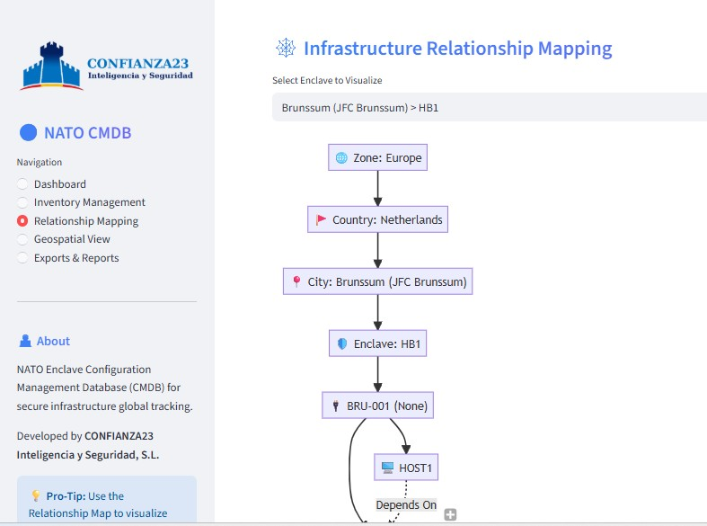
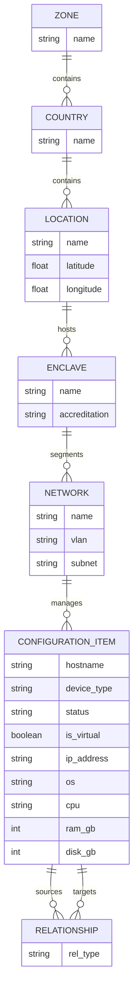
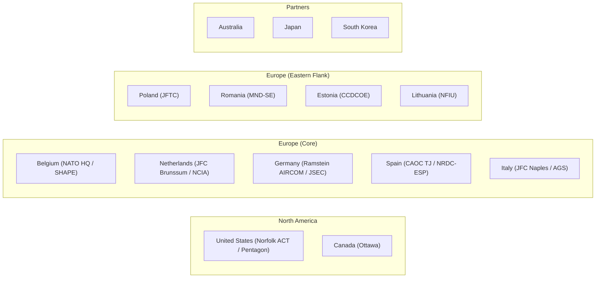
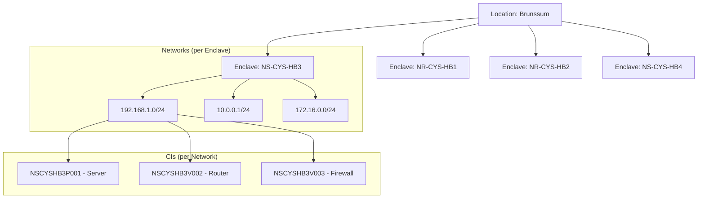

# 🌍 NATO Enclave CMDB Manager | CONFIANZA23 Inteligencia y Seguridad, S.L.

[](https://owasp.org/)
[](https://www.axelos.com/certifications/itil-service-management)
[](https://www.axelos.com/certifications/prince2)

## 📸 Application Dashboards
<p align="center">
  
  
</p>

A Streamlit-powered Configuration Management Database (CMDB) designed to manage NATO Enclave infrastructures, following **ITIL v4** and **PRINCE2** best practices.

## 📊 Database Architecture (ER Diagram)
The CMDB follows a strict hierarchical and relational model:



## 🌟 Highlights
- **Governance:** Managed under PRINCE2 framework (see [P1_PREPARATION](file:///c:/_CONFIANZA23/PRODUCTOS/31_ENCLAVE/P1_PREPARATION/)).
- **Service Management:** Built on ITIL SACM principles (see [P2_TECHNICAL](file:///c:/_CONFIANZA23/PRODUCTOS/31_ENCLAVE/P2_TECHNICAL/)).
- **Massive Scale:** Pre-populated with ~15,000 CIs across 32 NATO nations.
- **Naming Logic:** Standardized `NSCYSHB1P001` hostname convention.
- **Visualisations:** Mermaid.js network maps and Leaflet.js world mapping.
- **Compliance:** Support for NATO Unclassified (NU/NR) and Secret (NS) accreditations.

## 🗺️ NATO Strategic Locations Map
The CMDB includes all 32 member states and key strategic headquarters:



## 📐 Sample Enclave Hierarchy (Brunssum)
Each major location features a dual-tier security architecture:



## 🏷️ Naming Convention
Assets follow the standardized Hostname logic:
`[Level][Core][Enclave][Type][Sequence]`
- **Level:** `NS` (Secret), `NR` (Restricted).
- **Core:** `CYS` (Cyber Security).
- **Enclave:** 3-character location code (e.g., `HB3`).
- **Type:** `P` (Physical), `V` (Virtual).
- **Sequence:** 3-digit serial (e.g., `001`).
- *Example:* **`NSCYSHB3P001`**

## 🛠️ Tech Stack
- **Frontend:** Streamlit
- **Database:** SQLite (SQLAlchemy ORM)
- **Visualization:** Mermaid.js & Folium (Leaflet)
- **Exports:** CSV, JSON, XML, Markdown, TXT

## 🔧 Installation & Execution
You can use the provided Windows batch script for automated setup:
1. **Run build script:**
   ```cmd
   build.cmd
   ```
   *This will automatically install requirements and launch the application.*

Alternatively, run manually:
1. **Install dependencies:**
   ```bash
   pip install -r requirements.txt
   ```
2. **Launch the application:**
   ```bash
   streamlit run app.py
   ```

## 🏛️ Documentation Index (P1-P7 Governance)
This project follows the strict documentation silos required by CONFIANZA23:

| Silo | Description | Primary Document |
|:---|:---|:---|
| **P1_PREPARATION** | Business Case & Governance | [Project Initiation (PID)](file:///c:/_CONFIANZA23/PRODUCTOS/31_ENCLAVE/P1_PREPARATION/PID.md) |
| **P2_TECHNICAL** | SEMP & Configuration Mgmt | [Technical Service Design](file:///c:/_CONFIANZA23/PRODUCTOS/31_ENCLAVE/P2_TECHNICAL/Service_Design.md) |
| **P3_CONCEPT** | Operational Concept (ConOps) | [Operational Concept](file:///c:/_CONFIANZA23/PRODUCTOS/31_ENCLAVE/P3_CONCEPT/ConOps.md) |
| **P4_SYSTEM** | System & Security Requirements | [Requirements & Security](file:///c:/_CONFIANZA23/PRODUCTOS/31_ENCLAVE/P4_SYSTEM/SyRS_Security.md) |
| **P5_ARCHITECTURE** | System Architecture & Design | [Architecture Document](file:///c:/_CONFIANZA23/PRODUCTOS/31_ENCLAVE/P5_ARCHITECTURE/Architecture_Design.md) |
| **P6_VERIFICATION** | Verification & Validation | [V&V Plan & Report](file:///c:/_CONFIANZA23/PRODUCTOS/31_ENCLAVE/P6_VERIFICATION/Verification_Validation.md) |
| **P7_SCRUM** | Scrum Manifest & Backlog | [Scrum & Manifest](file:///c:/_CONFIANZA23/PRODUCTOS/31_ENCLAVE/P7_SCRUM/Scrum_Manifest.md) |

---

## 🏗️ Project Structure
- `app.py`: Main application entry point.
- `database/`: Models and database management session logic.
- `views/`: Modular Streamlit view components.
- `requirements.txt`: Project dependencies.
- `build.cmd`: Automated Windows build and launch wrapper.
